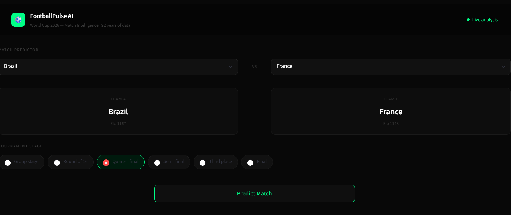
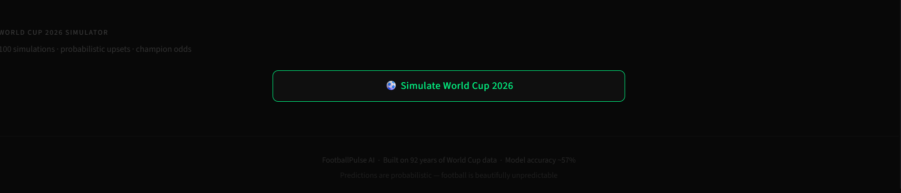
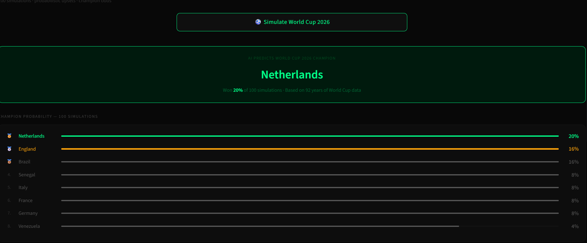
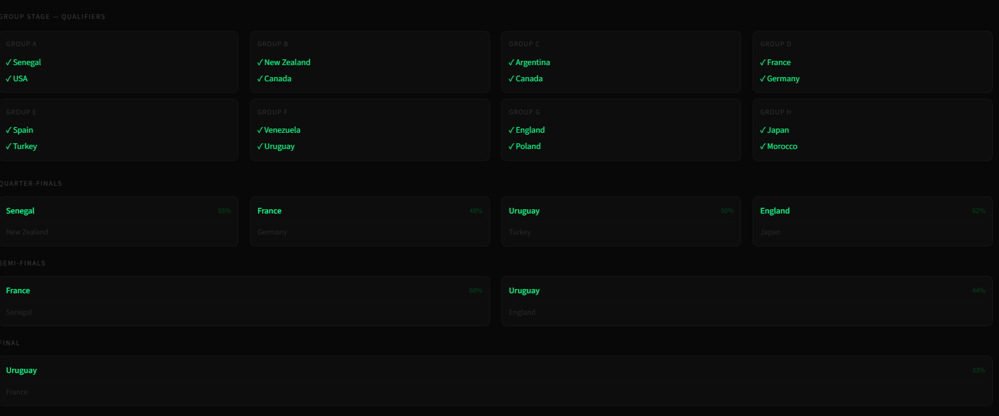

# ⚽ FootballPulse AI

### AI-Powered FIFA World Cup 2026 Match Prediction & Tournament Intelligence Platform

FootballPulse AI is an end-to-end machine learning project that predicts FIFA World Cup match outcomes, simulates entire tournaments, and tracks live World Cup news and sentiment in a single interactive dashboard.

Built using 92 years of World Cup history (1930–2022), the project combines feature engineering, Elo ratings, predictive modeling, Monte Carlo simulation, and real-time football intelligence to provide data-driven insights for World Cup matches.

---

## 🚀 Live Demo

**Streamlit App:** [Add Link]

**GitHub Repository:** [Add Link]

---

## 🎯 Project Overview

FootballPulse AI answers three questions:

### 1. Who is most likely to win a match?

Predicts win, draw, and loss probabilities for any World Cup matchup.

### 2. Why does the model think so?

Shows the key factors influencing the prediction, including Elo ratings, attacking strength, defensive strength, and recent form.

### 3. What could happen across the entire tournament?

Simulates the complete FIFA World Cup 2026 tournament and estimates championship probabilities using Monte Carlo simulations.

---

##  Key Features

### 🤖 Match Prediction Engine

* Predicts Team A Win / Draw / Team B Win probabilities
* Neutral-ground prediction logic
* Bidirectional probability averaging to eliminate home/away bias
* Interactive match selection dashboard

### 📊 Explainable AI Insights

* Elo rating comparison
* Attack and defense strength analysis
* Goal difference metrics
* Recent form comparison
* Historical performance indicators

### 🏆 Tournament Simulator

* Simulates the entire World Cup automatically
* Generates different outcomes on each run
* Allows realistic upsets and underdog victories
* Produces a complete tournament bracket

### 🎲 Monte Carlo Analysis

* Runs 100+ tournament simulations
* Estimates championship probabilities
* Identifies likely winners
* Quantifies uncertainty

### 🌟 Dark Horse Detection

Highlights teams with relatively low expectations but strong tournament-winning potential.

### ⚡ Biggest Upset Tracker

Detects the most surprising result generated during tournament simulation.

### 📰 Match Intelligence Dashboard

* Trending World Cup topics
* Latest World Cup headlines
* News sentiment classification
* Automatic fallback systems for reliable news retrieval

---

## 📂 Dataset

### Source

FIFA World Cup historical dataset from Kaggle, extended with manually collected 2018 and 2022 World Cup match data.

### Final Dataset

| Metric              | Value       |
| ------------------- | ----------- |
| Time Span           | 1930 – 2022 |
| Total Matches       | 980         |
| Features            | 19          |
| Target Classes      | 3           |
| Tournaments Covered | 22          |

### Target Classes

* Team A Win
* Draw
* Team B Win

---

## 🧠 Feature Engineering

One of the main goals of this project was building realistic features without data leakage.

### Team Strength Features

* Elo Rating
* Elo Difference
* Elo Ratio
* Attack Strength
* Defensive Strength
* Goal Difference

### Relative Strength Features

* Attack Difference
* Defense Difference
* Goal Difference Difference

### Form Features

* Recent Form (weighted last 5 matches)
* Historical Win Rate
* Form Difference

### Match Context Features

* Tournament Stage Encoding
* Knockout Importance

All features were calculated using only information available before each match occurred.

---

## 📈 Model Development

Three machine learning models were evaluated:

| Model               | Test Accuracy |
| ------------------- | ------------- |
| Logistic Regression | 58.67%        |
| Random Forest       | 57.65%        |
| XGBoost             | 59.69%        |

### Final Production Model

**Random Forest Classifier**

Although XGBoost achieved slightly higher accuracy, it exhibited significant overfitting. Random Forest provided the best balance between performance, stability, and generalization.

### Cross Validation

* CV Mean Accuracy: 55.71%
* CV Standard Deviation: 2.81%

This consistency indicated reliable model behavior across different splits.

---

## 📊 Model Performance

### Classification Performance

| Class      | Precision | Recall |
| ---------- | --------- | ------ |
| Draw       | 0.33      | 0.11   |
| Team A Win | 0.61      | 0.91   |
| Team B Win | 0.53      | 0.23   |

Football outcomes are inherently noisy, especially draws between evenly matched teams. Even professional football prediction systems rarely achieve accuracy beyond 60–65%.

---

## 🔍 Technical Challenges Solved

### Challenge 1: Historical Data Gaps

The original dataset ended in 2014.

**Solution**

* Added complete 2018 and 2022 World Cup data manually
* Expanded dataset to 980 matches

---

### Challenge 2: Data Leakage

Several commonly used football statistics accidentally include future information.

**Solution**

* Rebuilt all historical features chronologically
* Ensured each match only used information available at prediction time

---

### Challenge 3: Penalty Shootouts

World Cup knockout matches often end in penalties.

**Solution**

* Extracted winners correctly from penalty shootout records
* Preserved realistic tournament outcomes

---

### Challenge 4: Prediction Bias

Traditional models often treat one team as "home" and another as "away."

**Solution**

* Introduced bidirectional neutral prediction
* Predicted A vs B and B vs A
* Averaged both probabilities

This better reflects actual World Cup conditions where matches occur on neutral grounds.

---

### Challenge 5: Tournament Uncertainty

Single predictions do not capture tournament randomness.

**Solution**

* Built probabilistic tournament simulation
* Added Monte Carlo analysis
* Allowed realistic upset scenarios

---

## ⚠️ Current Limitations

* Historical dataset size remains relatively small compared to modern football datasets.
* Player injuries and squad selections are not incorporated.
* Team form outside World Cup competitions is not included.
* Draw prediction remains the most difficult classification task.

These limitations represent opportunities for future improvement.

---

## 🛠️ Tech Stack

### Machine Learning

* Python
* Scikit-Learn
* XGBoost
* Pandas
* NumPy

### Visualization

* Plotly
* Matplotlib

### Web Application

* Streamlit

### NLP & News Analysis

* VADER Sentiment Analysis
* NewsAPI
* RSS Feeds

### Development Tools

* Jupyter Notebook
* Git
* GitHub

---

## 📁 Project Structure

```text
FootballPulse-AI/
│
├── data/
├── notebooks/
├── src/
├── models/
├── app/
├── reports/
├── requirements.txt
└── README.md
```

---

## 🖼️ Screenshots

### Match Prediction Dashboard



### Tournament Simulator


### Monte Carlo Championship Analysis



## 📚 What I Learned

This was my first fully independent machine learning project.

Key takeaways included:

* End-to-end ML pipeline development
* Feature engineering for sports analytics
* Data leakage prevention
* Model evaluation and overfitting diagnosis
* Explainable AI design
* Interactive dashboard development
* Deployment and project presentation

---

## 👩‍💻 Author

**Sadia Halima**

Sophomore AI Undergraduate

Interested in:

* Machine Learning
* Data Science
* Sports Analytics
* AI Product Development

Feel free to connect or provide feedback.
